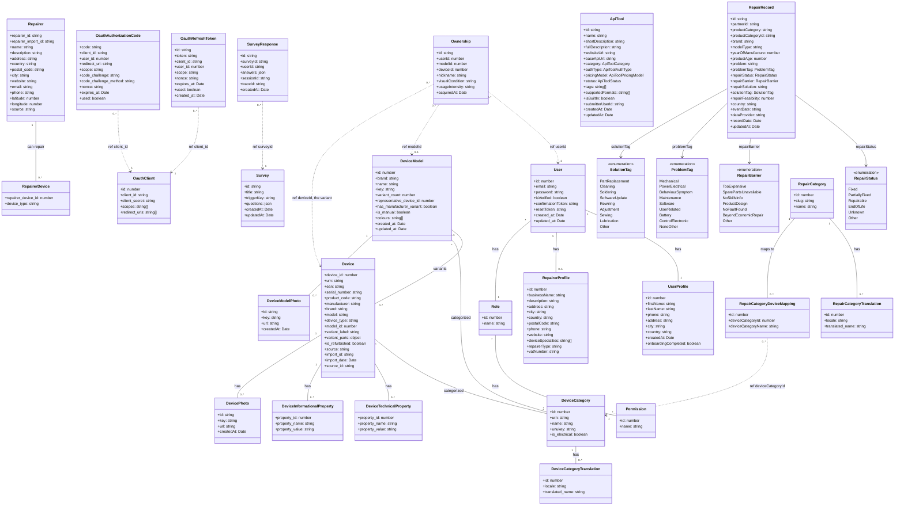

```mermaid

classDiagram

    %% ═══════════════════════════════
    %% user-management
    %% ═══════════════════════════════

    class User {
        +id: number
        +email: string
        +password: string
        +isVerified: boolean
        +confirmationToken: string
        +resetToken: string
        +created_at: Date
        +updated_at: Date
    }

    class UserProfile {
        +id: number
        +firstName: string
        +lastName: string
        +phone: string
        +address: string
        +city: string
        +country: string
        +createdAt: Date
        +onboardingCompleted: boolean
    }

    class RepairerProfile {
        +id: number
        +businessName: string
        +description: string
        +address: string
        +city: string
        +country: string
        +postalCode: string
        +phone: string
        +website: string
        +deviceSpecialties: string[]
        +repairerType: string
        +vatNumber: string
    }

    class Role {
        +id: number
        +name: string
    }

    class Permission {
        +id: number
        +name: string
    }

    User "1" -- "1" UserProfile : has
    User "1" -- "0..1" RepairerProfile : has
    User "*" -- "1" Role : has
    Role "*" -- "*" Permission : has

    %% ═══════════════════════════════
    %% repairers-service
    %% ═══════════════════════════════

    class Repairer {
        +repairer_id: string
        +repairer_import_id: string
        +name: string
        +description: string
        +address: string
        +country: string
        +postal_code: string
        +city: string
        +website: string
        +email: string
        +phone: string
        +latitude: number
        +longitude: number
        +source: string
    }

    class RepairerDevice {
        +repairer_device_id: number
        +device_type: string
    }

    Repairer "1" -- "0..*" RepairerDevice : can repair

    %% ═══════════════════════════════
    %% devices-service
    %% ═══════════════════════════════

    class Device {
        +device_id: number
        +urn: string
        +ean: string
        +serial_number: string
        +product_code: string
        +manufacturer: string
        +brand: string
        +model: string
        +device_type: string
        +model_id: number
        +variant_label: string
        +variant_parts: object
        +is_refurbished: boolean
        +source: string
        +import_id: string
        +import_date: Date
        +source_id: string
    }

    class DeviceModel {
        +id: number
        +brand: string
        +name: string
        +key: string
        +variant_count: number
        +representative_device_id: number
        +has_manufacturer_variant: boolean
        +is_manual: boolean
        +colours: string[]
        +created_at: Date
        +updated_at: Date
    }

    class DeviceModelPhoto {
        +id: string
        +key: string
        +url: string
        +createdAt: Date
    }

    class DeviceCategory {
        +id: number
        +urn: string
        +name: string
        +unukey: string
        +is_electrical: boolean
    }

    class DeviceCategoryTranslation {
        +id: number
        +locale: string
        +translated_name: string
    }

    class DeviceTechnicalProperty {
        +property_id: number
        +property_name: string
        +property_value: string
    }

    class DeviceInformationalProperty {
        +property_id: number
        +property_name: string
        +property_value: string
    }

    class DevicePhoto {
        +id: string
        +key: string
        +url: string
        +createdAt: Date
    }

    Device "*" -- "*" DeviceCategory : categorized
    Device "1" -- "0..*" DeviceTechnicalProperty : has
    Device "1" -- "0..*" DeviceInformationalProperty : has
    Device "1" -- "0..*" DevicePhoto : has
    DeviceCategory "1" -- "0..*" DeviceCategoryTranslation : has
    DeviceModel "0..1" -- "0..*" Device : variants
    DeviceModel "*" -- "*" DeviceCategory : categorized
    DeviceModel "1" -- "0..*" DeviceModelPhoto : has

    %% ═══════════════════════════════
    %% ownership-service
    %% ═══════════════════════════════

    class Ownership {
        +id: string
        +userId: number
        +modelId: number
        +deviceId: number
        +nickname: string
        +visualCondition: string
        +usageIntensity: string
        +acquiredAt: Date
    }

    Ownership "0..*" ..> "1" User : ref userId
    Ownership "0..*" ..> "0..1" DeviceModel : ref modelId
    Ownership "0..*" ..> "0..1" Device : ref deviceId, the variant

    %% ═══════════════════════════════
    %% oauth-service
    %% ═══════════════════════════════

    class OauthClient {
        +id: number
        +client_id: string
        +client_secret: string
        +scopes: string[]
        +redirect_uris: string[]
    }

    class OauthRefreshToken {
        +id: string
        +token: string
        +client_id: string
        +user_id: number
        +scope: string
        +nonce: string
        +expires_at: Date
        +used: boolean
        +created_at: Date
    }

    class OauthAuthorizationCode {
        +code: string
        +client_id: string
        +user_id: number
        +redirect_uri: string
        +scope: string
        +code_challenge: string
        +code_challenge_method: string
        +nonce: string
        +expires_at: Date
        +used: boolean
    }

    OauthRefreshToken "0..*" ..> "1" OauthClient : ref client_id
    OauthAuthorizationCode "0..*" ..> "1" OauthClient : ref client_id

    %% ═══════════════════════════════
    %% surveys-service
    %% ═══════════════════════════════

    class Survey {
        +id: string
        +title: string
        +triggerKey: string
        +questions: json
        +createdAt: Date
        +updatedAt: Date
    }

    class SurveyResponse {
        +id: string
        +surveyId: string
        +userId: string
        +answers: json
        +sessionId: string
        +traceId: string
        +createdAt: Date
    }

    SurveyResponse "0..*" ..> "1" Survey : ref surveyId

    %% ═══════════════════════════════
    %% api-catalog-service
    %% ═══════════════════════════════

    class ApiTool {
        +id: string
        +name: string
        +shortDescription: string
        +fullDescription: string
        +websiteUrl: string
        +baseApiUrl: string
        +category: ApiToolCategory
        +authType: ApiToolAuthType
        +pricingModel: ApiToolPricingModel
        +status: ApiToolStatus
        +tags: string[]
        +supportedFormats: string[]
        +isBuiltIn: boolean
        +submitterUserId: string
        +createdAt: Date
        +updatedAt: Date
    }

    %% ═══════════════════════════════
    %% repair-monitor-service
    %% ═══════════════════════════════

    class RepairStatus {
        <<enumeration>>
        Fixed
        PartiallyFixed
        Repairable
        EndOfLife
        Unknown
        Other
    }

    class RepairBarrier {
        <<enumeration>>
        TooExpensive
        SparePartsUnavailable
        NoSkillsInfo
        ProductDesign
        NoFaultFound
        BeyondEconomicRepair
        Other
    }

    class ProblemTag {
        <<enumeration>>
        Mechanical
        PowerElectrical
        BehaviourSymptom
        Maintenance
        Software
        UserRelated
        Battery
        ControlElectronic
        NoneOther
    }

    class SolutionTag {
        <<enumeration>>
        PartReplacement
        Cleaning
        Soldering
        SoftwareUpdate
        Rewiring
        Adjustment
        Sewing
        Lubrication
        Other
    }

    class RepairRecord {
        +id: string
        +partnerId: string
        +productCategory: string
        +productCategoryId: string
        +brand: string
        +modelType: string
        +yearOfManufacture: number
        +productAge: number
        +problem: string
        +problemTag: ProblemTag
        +repairStatus: RepairStatus
        +repairBarrier: RepairBarrier
        +repairSolution: string
        +solutionTag: SolutionTag
        +repairFeasibility: number
        +country: string
        +eventDate: string
        +dataProvider: string
        +recordDate: Date
        +updatedAt: Date
    }

    class RepairCategory {
        +id: number
        +slug: string
        +name: string
    }

    class RepairCategoryTranslation {
        +id: number
        +locale: string
        +translated_name: string
    }

    class RepairCategoryDeviceMapping {
        +id: number
        +deviceCategoryId: number
        +deviceCategoryName: string
    }

    RepairCategory "1" -- "0..*" RepairCategoryTranslation : has
    RepairCategory "1" -- "0..*" RepairCategoryDeviceMapping : maps to
    RepairCategoryDeviceMapping "0..*" ..> "1" DeviceCategory : ref deviceCategoryId
    RepairRecord --> RepairStatus : repairStatus
    RepairRecord --> RepairBarrier : repairBarrier
    RepairRecord --> ProblemTag : problemTag
    RepairRecord --> SolutionTag : solutionTag

```

